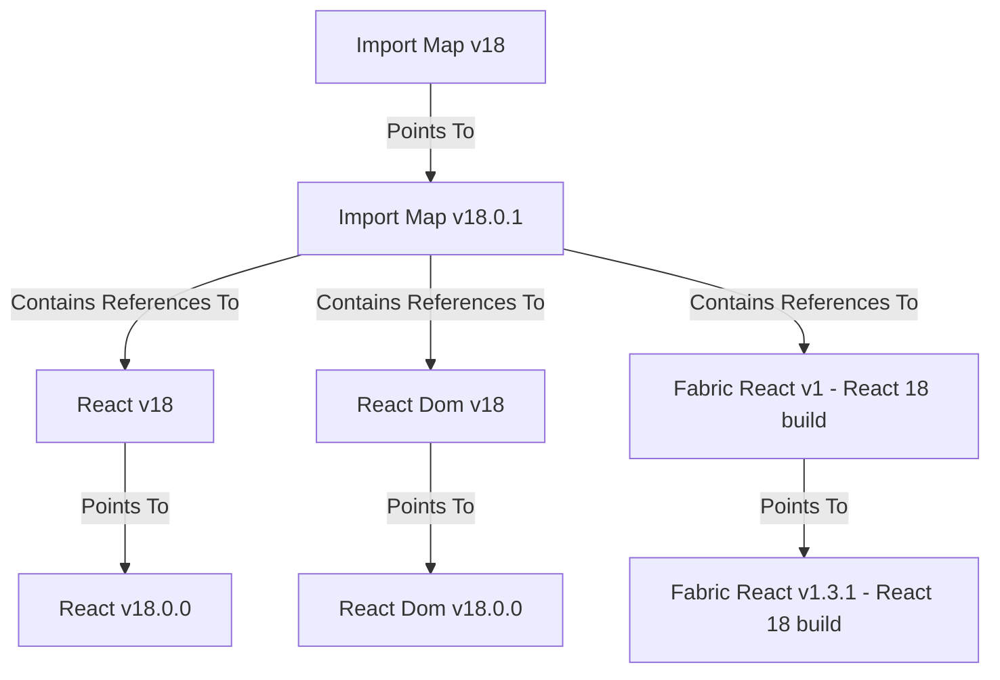

# React Eik Setup

The following attempts to explain the current Eik setup for React. Something similar should be used for Vue and Lit eventually.

## Diagramatic Overview

## React Versions

Each version of React has a matching Eik published version.
Some examples of published versions are:

* 18.0.0 https://assets.finn.no/npm/react/18.0.0
* 17.0.1 https://assets.finn.no/npm/react/17.0.1
* 16.14.0 https://assets.finn.no/npm/react/16.14.0

## React Aliases

Each Eik published version of React has a matching Eik major version alias.
Some examples of aliases are:

* v18 https://assets.finn.no/npm/react/v18
* v17 https://assets.finn.no/npm/react/v17
* v16 https://assets.finn.no/npm/react/v16

## Fabric React Versions

Fabric React publishes builds to Eik for each major version of React that we support (currently React v17 and v18). 
These exist as separate files within each version of Fabric React that is published to Eik.
For example:

* https://assets.finn.no/pkg/@fabric-ds/react/1.4.0/fabric-react-17.js
* https://assets.finn.no/pkg/@fabric-ds/react/1.4.0/fabric-react-18.js

## Fabric React Aliases

Each Eik published version of Fabric React has a matching Eik major version alias.
Some examples of aliases are:

* https://assets.finn.no/pkg/@fabric-ds/react/v0
* https://assets.finn.no/pkg/@fabric-ds/react/v1

## Import Map Versions

Import map versions exist for React that group correct major versions of React and Fabric React together. 
The versions for these maps match the major React versions in question. 
ie. Versions of React 18 are handled in version 18 of the import map, versions of React 17 are handled in version 17 of the import map etc.
For example:

* https://assets.finn.no/map/react/18.0.1
* https://assets.finn.no/map/react/17.0.0

## Import Map Aliases

Each major version of an import map is also aliased.

For example:

* https://assets.finn.no/map/react/v18
* https://assets.finn.no/map/react/v17
