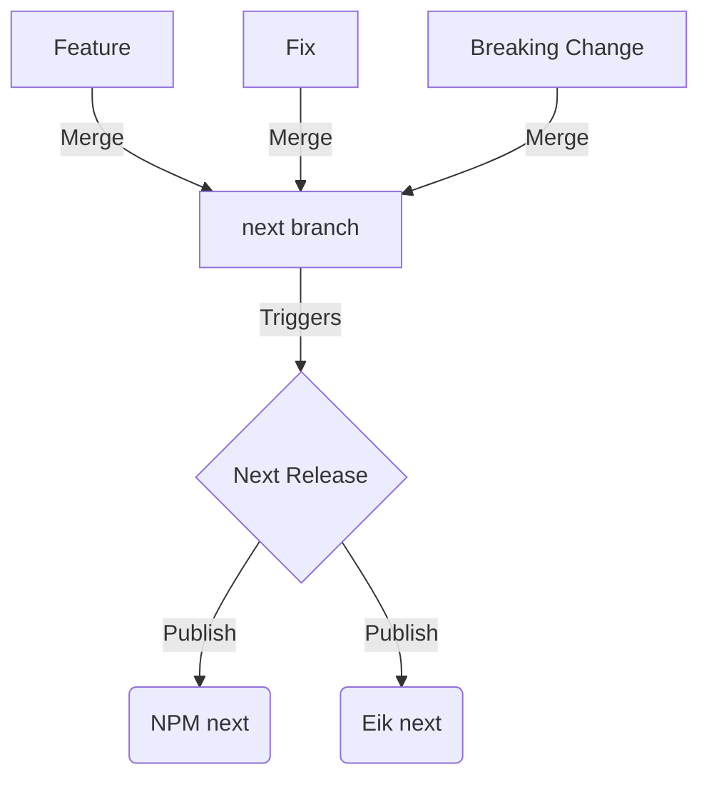
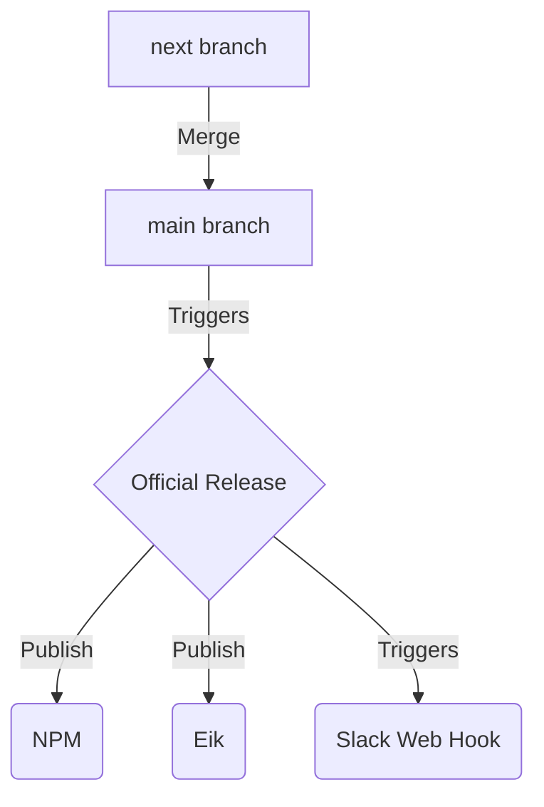

# RFC: Fabric Releases and Release Schedule

## Background

There will always be a need for us to continue to refine and improve the various Fabric libs through releases. 
However, new versions of our design system mean that teams who are busy working on functionality for Finn need to take time out of their schedules to upgrade.
Theres no avoiding this of course but we can do our utmost to make the process as quick, simple and straightforward for Fabric users as possible. 
This RFC proposes a way to formalise and structure our releases in a way that aims to minimise Fabric version upgrade frictions for our users.

## Proposed Concepts/Principles

### Fixed, regular release dates

The most important idea here is to release on a fixed schedule. This might perhaps be once per month. 
This will make it easy for teams to schedule maintenance and update work around the schedule and at the same time turn down renovate noise.

### Good documentation and upgrade guides

Releases should come with changelogs and upgrade guides. Always. It should be easy for teams to follow our guides to minimize upgrade friction.
Particularly important when there are breaking changes.

### Good communication around releases

Releases should be well communicated. Slack messages should inform users when a new release is available with links to the upgrade documentation.

### Automate what we can

Semantic release, conventional commits, commitizen and web hooks connected to Slack can be used to automate as much as possible. This will make our
lives easier while working of course but is especially important to ensure our releases go out consistently (on time, with links to release notes etc).

### "Next" releases for ongoing work

We can't allow a fixed release cycle to block us from getting immediate work into the hands of those who can't wait weeks for the next release.
To solve this we should develop against a `next` branch that is constantly published to NPM and Eik using a `next` tag. (eg. `1.0.0-next.1`)
Anyone needing a feature we have only just completed can install the `next` version while waiting for the next release window.
Cutting an actual release then would simply be a matter of merging `next` into `main` and writing an upgrade guide.

### Backport bugfixes and urgent features

Anything that must go out on the main channel can as agreed upon by the team. To do so, we can cherry pick commits from next to main. Changelogs and slack notifications will go out and might include an explanation as to why we felt it was important enough to not wait for the next release cycle. Upgrade guides would typically not be required since such changes will likely not include new features or breaking changes. If for some reason they do, an upgrade guide would be necessary.

## Implementation

The following steps would need to be taken to implement this from a technical perspective would look roughly something like this:

1. Create and work against a `next` branch
2. Setup renovate to auto merge deps/dev deps to next
3. Add commitizen to ensure conventional commits are used
4. Setup semantic release to auto publish anything merged to next with a `next` tag.
5. Setup semantic release to auto publish from main/master including auto generated release notes
6. Setup a reminder for us when a new release should be cut
7. When doing a release:
  * Write update guide (from previous version only)
  * Merge master/main
  * Auto publish to NPM and Eik happens
  * Add link to update guide in release tag on GH
  * Release triggers a slack webhook to notify that a new release is ready with link to update guide

## Other thoughts/questions

* How often should full releases happen? (I somewhat arbitrarily propose once per month. Eg. 3th Thursday of the month)
* Where should we document whatever we decide? Perhaps a page on the docs site?
* It might be nice to have a `next` version of the docs sites published as well (though probably not strictly necessary)
* Maybe using a squash and merge approach (at least from next -> main) would create a cleaner git record for people?

## Diagrams

### Day to day workflow

### Release workflow

