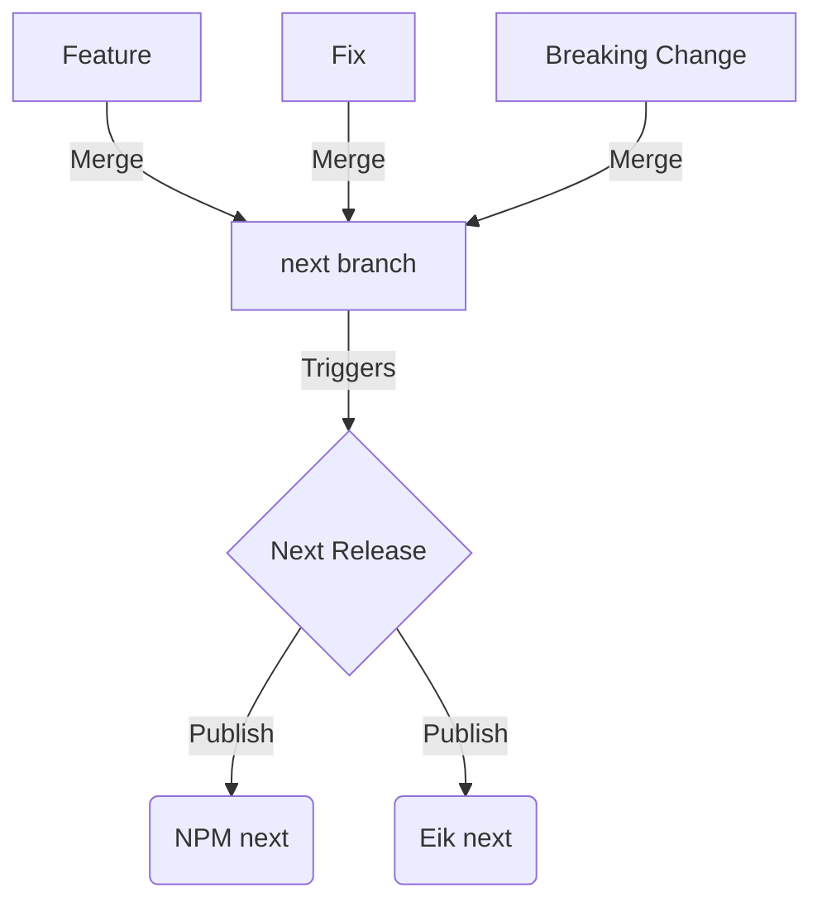
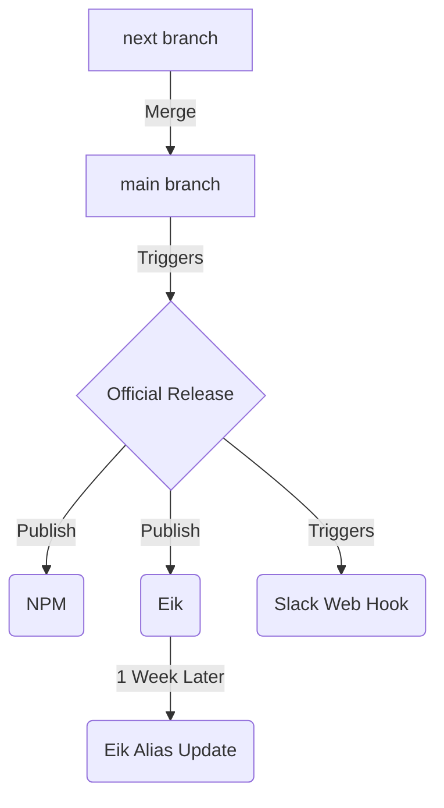

# RFC: Fabric Releases and Release Schedule

## Background

There will always be a need for us to continue to refine and improve the various Fabric libs through releases. 
However, new versions of our design system mean that teams who are busy working on functionality for Finn need to take time out of their schedules to upgrade.
Theres no avoiding this of course but we can do our utmost to make the process as quick, simple and straightforward for Fabric users as possible. 
This RFC proposes a way to formalise and structure our releases in a way that aims to minimise Fabric version upgrade frictions for our users.

## Proposed Concepts/Principles

### Release when ready

Release features, bug fixes and dependency updates as necessary but in a thoughtful way. We want to avoid constant update noise (for example from renovate bot) while also avoiding blocking teams for getting changes when they need them.

### Good documentation and upgrade guides

Releases should come with changelogs and upgrade guides (as necessary). It should be easy for teams to follow our guides to minimize upgrade friction.
Particularly important when there are breaking changes.

### Good communication around releases

Releases should be well communicated. Slack messages should inform users when a new release is available with links to the upgrade documentation.

### Automate what we can

Semantic release, conventional commits, commitizen and web hooks connected to Slack can be used to automate as much as possible. This will make our
lives easier while working of course but is especially important to ensure our releases go out consistently (on time, with links to release notes etc).

### "Next" releases for ongoing work

We will develop against a `next` branch that is constantly published to NPM and Eik using a `next` tag. (eg. `1.0.0-next.1`)
Testing of upcoming releases can be done internally by the team by installing the `next` version. Renovate bot updates will be made against next as well to avoid constant updates to main/master.
Cutting an actual release then will be a matter of merging `next` into `main` and writing an upgrade guide if necessary.

## Eik

Fabric libraries are available on Eik and are aliased. Aliasing gives us the ability to update everyone at the same time and keep teams on the same version across the Finn site. To help ensure that a new release isn't going to break everyones pages, we plan to update Eik aliases for new releases some days after the release itself. Current thought is that about 1 week later should be about right but we may adjust this. It might be that a day or 2 is enough, just enough to ensure that if there needs to be release fixups performed, we don't roll out the alias update until after.

## Implementation

The following steps would need to be taken to implement this from a technical perspective would look roughly something like this:

1. Create and work against a `next` branch
2. Setup renovate to auto merge deps/dev deps to next
3. Add commitizen to ensure conventional commits are used
4. Setup semantic release to auto publish anything merged to next with a `next` tag.
5. Setup semantic release to auto publish from main/master including auto generated release notes
6. When doing a release:
  * Write update guide if necessary (from previous version only)
  * Merge master/main
  * Auto publish to NPM and Eik happens
  * Add link to update guide in release tag on GH
  * Release triggers a slack webhook to notify that a new release is ready with link to update guide
7. Some time after a release has been cut, update the Eik alias.

## Diagrams

### Day to day workflow

### Release workflow

